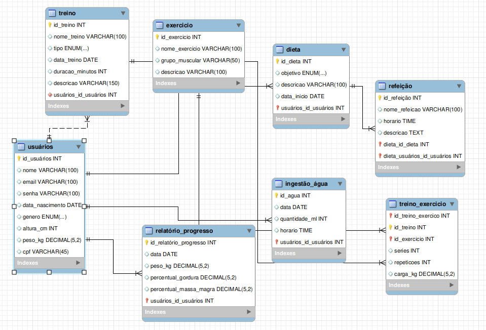

# InMove

Um modelo para o desenvolvimento do Projeto Integrador do Curso de Técnico em Desenvolvimento de Sistemas para a Internet Integrado ao Ensino Médio do IFC - Campus Araquari.

O **InMove** é um aplicativo completo focado em saúde e bem-estar, oferecendo funcionalidades para a criação de treinos e dietas personalizadas, além de relatórios comparativos de progresso e dicas de receitas saudáveis. Ideal para quem busca alcançar objetivos como hipertrofia, emagrecimento ou simplesmente melhorar a qualidade de vida, o InMove fornece ferramentas práticas e motivadoras para acompanhar e otimizar seu desempenho, ajudando a conquistar resultados sustentáveis e um estilo de vida mais saudável.

(https://docs.google.com/spreadsheets/d/1KXuMJ9TK7GPyahR_BfLwfn4ec7vX7DgiHx42vFc4E7g/edit?usp=sharing).

Professor: [Marco André Mendes](github.com/marcoandre)

Equipe:
- Ana Luiza Bernardo Timoteo - https://github.com/anatimoteo
- Elisa Cecília Rocha de Almeida Coelho - https://github.com/elisacoelho
- Isabelle Cristina da Cunha - https://github.com/isabelleIFC
- Vitor Schmidt - https://github.com/vitoorschmidt

Links do projeto:
(*Coloque aqui os links para a documentação do projeto e os repositórios e plubicação do backend e frontend.*)
-   [Documentação (esse documento)](https://github.com/isabelleIFC/InMove.git)
-   Backend: [Repositório](https://github.com/InMovePI/InMoveBack) e [Publicação](https://pi-backend.herokuapp.com/)
-   Frontend: [Repositório](github.com/marcoandre/pi-frontend) e [Publicação](https://pi-frontend.herokuapp.com/)

# 1. Desenvolvimento

**1.1 Modelos de Sistemas**

**1.1.3 Ordem de Serviço (O.S.)**

**Sistema Integrado de Treinos e Bem-Estar**

  Felipe é um cliente que recentemente iniciou sua jornada como atleta de corrida. Descobriu a corrida como uma paixão, além de ser uma prática extremamente benéfica para sua saúde e bem-estar. Para apoiar seu desenvolvimento como corredor, Felipe também pratica musculação, que fortalece seu corpo e aumenta sua resistência, complementando os treinos de corrida.

  No entanto, ao entrar nesse universo fitness, Felipe se deparou com um grande desafio: o uso de diversas ferramentas distintas para monitorar suas atividades e progresso. Ele acabava se perdendo entre diferentes plataformas, anotações de metas, avanços e relatórios de treino, o que demandava um tempo considerável de organização. Muitas vezes, as informações ficavam descentralizadas e ele não conseguia acompanhar seu desempenho de maneira eficiente.

  Diante disso, Felipe percebeu a necessidade de um sistema integrado que centralizasse todas as informações importantes em um único lugar. Ele deseja uma solução personalizada para acompanhar seus treinos de musculação e corrida, seu desempenho nas corridas, o controle de sua alimentação, dieta e ingestão diária de água, tudo de forma simples e intuitiva.

  Além disso, é essencial que o sistema ofereça incentivos e estímulos para ajudá-lo a manter a disciplina e o foco nos seus objetivos, promovendo um acompanhamento contínuo e motivador em sua jornada de desenvolvimento físico e atlético.

# 2. Situação Problema

  A **InMove** é uma empresa especializada no desenvolvimento de soluções tecnológicas voltadas para o universo fitness e bem-estar. Fundada há 2 anos por ex-alunos desenvolvedores que são apaixonados por esportes e saúde. A InMove tem como missão criar plataformas que integrem e facilitem o gerenciamento de treinos, alimentação e saúde de seus usuários. A equipe da InMove é composta por profissionais, incluindo desenvolvedores, designers e especialistas em nutrição e fisiologia esportiva. A empresa se destaca por sua capacidade de criar soluções personalizadas, ajudando tanto indivíduos quanto empresas do setor fitness a oferecerem uma experiência mais eficiente e integrada para seus clientes.

  A InMove surgiu com a missão de resolver um problema crescente entre aqueles que buscam melhorar sua saúde e alcançar seus objetivos de bem-estar: a fragmentação das informações. Muitas pessoas, como o cliente Felipe, se deparam com a dificuldade de monitorar seu progresso, pois utilizam diferentes plataformas e ferramentas para registrar suas atividades físicas, alimentação e saúde, tornando o processo de acompanhamento complexo e desorganizado.

  Felipe, por exemplo, começou a praticar atividades físicas com o objetivo de perder peso e melhorar a saúde, mas logo percebeu que não conseguia acompanhar seus treinos de musculação, suas corridas e, ao mesmo tempo, controlar sua alimentação e ingestão de água de forma eficaz. Ela usava um aplicativo para os treinos, outro para a nutrição e outro ainda para registrar seus parâmetros de saúde, mas essa sobrecarga de informações dispersas acabava dificultando a visualização do seu progresso. O tempo perdido na organização desses dados, muitas vezes incompletos ou desatualizados, prejudicava a motivação e comprometia o alcance de seus objetivos.

  Além disso, Felipe encontrou dificuldades para estabelecer um plano de treino e alimentação consistente que fosse adequado às suas necessidades específicas. Embora existissem diversos programas disponíveis, poucos ofereciam uma personalização real que levasse em consideração suas condições de saúde, metas e preferências. A falta de um acompanhamento contínuo e de incentivos consistentes também foi um fator desmotivador, o que fez com que, algumas vezes, ela abandonasse suas rotinas.

  Outro desafio enfrentado por Felipe foi a escassez de feedbacks que ajudassem a ajustar seu treinamento e alimentação. As orientações eram vagas, sem considerar seus resultados anteriores e a evolução dos parâmetros de desempenho, como a resistência, o aumento da força ou as melhorias na performance cardiovascular.

  Com base nos desafios enfrentados por Felipe e observando a situação de muitos outros usuários, é evidente que há uma grande necessidade de uma solução integrada que centralize todas as informações relacionadas ao bem-estar e à saúde do indivíduo. A InMove tem a oportunidade de resolver esse problema ao criar uma plataforma que, além de reunir dados de treinos, alimentação e saúde em um único sistema, também ofereça um acompanhamento contínuo e personalizado. A plataforma fornecerá recomendações de treino, sugestões alimentares, relatórios constantes e, principalmente, incentivos para manter a motivação alta. A integração dessas funcionalidades em um único software tornaria o processo de alcançar os objetivos de saúde e bem-estar mais simples, eficiente e, acima de tudo, motivador.

# 3. Descrição da proposta

  A plataforma InMove visa centralizar e simplificar o acompanhamento da saúde e do bem-estar dos usuários, resolvendo problemas como a dispersão de dados e a falta de personalização no processo de treino e nutrição. O objetivo principal da plataforma é integrar todas as informações sobre treinos, alimentação, hidratação, saúde e performance física em um único sistema, com uma interface prática e intuitiva que permita aos usuários monitorar e ajustar seus hábitos de forma eficiente e personalizada.

  A plataforma será voltada exclusivamente para usuários finais, ou seja, indivíduos que desejam melhorar sua saúde e desempenho físico por meio do acompanhamento de treinos e alimentação personalizada.

  O software proporcionará as seguintes funcionalidades:

  **Monitoramento de treinos e Relatórios de Desempenho:** Os usuários poderão registrar suas atividades físicas, como corridas, musculação e outros tipos de treino, permitindo acompanhar seu desempenho, evolução e o atingimento de metas.

  **Criação de dietas personalizadas:** Com base nas informações fornecidas pelos próprios usuários, a plataforma gerará dietas específicas, adaptadas aos seus objetivos e necessidades nutricionais, como emagrecimento, ganho de massa muscular ou manutenção da saúde.

  **Lembretes de ingestão de água:** A plataforma enviará lembretes automáticos para incentivar a hidratação ao longo do dia, um fator essencial para o bom desempenho nos treinos e para a saúde em geral.

  
# 4. Modelagem de Dados

# Modelo Entidade-Relacionamento (MER)

# Requisitos Funcionais e Regras de Negócio - Sistema InMove

RF001: O sistema deve permitir o cadastro de novos usuários com informações básicas como nome, idade, sexo, peso, altura, objetivo (emagrecimento, hipertrofia, etc.), nível de atividade física e preferências alimentares.
RN001: O sistema deve permitir que o usuário preencha campos como nome, idade, peso, altura, objetivo, nível de atividade física e preferências alimentares. Esses dados são obrigatórios para gerar planos personalizados.

RF002: O sistema deve gerar automaticamente planos de treino personalizados para o usuário, considerando suas informações de perfil (objetivo, nível de atividade física, entre outros).
RN002: O sistema deve gerar planos de treino baseados no objetivo do usuário, considerando fatores como intensidade, frequência e tipo de treino (corrida, musculação, etc.).

RF003: O sistema deve gerar automaticamente planos alimentares personalizados, levando em consideração o objetivo do usuário (emagrecimento, ganho de massa muscular, etc.).
RN003: O sistema deve criar planos alimentares com base nas preferências alimentares do usuário e nas necessidades nutricionais específicas para seu objetivo.

RF004: O sistema deve fornecer relatórios de desempenho, permitindo que o usuário visualize seu progresso em relação aos seus objetivos.
RN004: O sistema deve atualizar os relatórios de desempenho regularmente, mostrando dados como calorias queimadas, progresso nos treinos, evolução na performance, entre outros.

RF005: O sistema deve enviar lembretes diários sobre a ingestão de água, com base nas necessidades do usuário.
RN005: O sistema deve permitir que o usuário defina a quantidade de água a ser ingerida diariamente e enviar lembretes automáticos para garantir que a meta seja cumprida.

RF006: O sistema deve permitir que o usuário acompanhe seu progresso em relação aos treinos e dietas, com gráficos e indicadores de evolução.
RN006: O sistema deve gerar gráficos interativos que mostram a evolução no emagrecimento, ganho de massa muscular ou qualquer outro objetivo do usuário.

RF007: O sistema deve permitir que o usuário adicione e registre seus treinos e refeições diárias para melhorar o acompanhamento de seu progresso.
RN007: O sistema deve ter campos de entrada para os treinos e refeições, possibilitando o registro manual ou automático dos dados fornecidos pelo usuário.

RF008: O sistema deve permitir que o usuário adicione metas diárias para os treinos e alimentação (quantidade de exercícios, ingestão calórica, etc.).
RN008: O sistema deve possibilitar que o usuário defina metas diárias de treino e alimentação, com base em seu plano personalizado.

RF009: O sistema deve fornecer um histórico detalhado de todas as mudanças no plano de treino e alimentação ao longo do tempo, incluindo datas e ajustes realizados.
RN009: O sistema deve permitir que o usuário visualize a evolução de seus planos, com registros de alterações e novos ajustes, para melhor controle de seu progresso.

RF010: O sistema deve integrar dados de dispositivos de monitoramento de saúde (como smartwatches, balanças, etc.) para atualizar automaticamente as informações de desempenho.
RN010: O sistema deve ter uma API que permita integração com dispositivos de monitoramento de saúde, como wearables, para registrar dados automaticamente.

# Requisitos Não Funcionais

RNF001: O sistema será acessível via aplicativo móvel e web, com uma interface responsiva.

RNF002: O sistema deve garantir a segurança dos dados do usuário, utilizando criptografia para informações sensíveis.

RNF003: O sistema deverá ser de fácil utilização, com uma interface intuitiva e amigável para usuários de todas as idades e níveis de conhecimento.

RNF004: O sistema deve ter uma performance que suporte simultaneamente um grande número de usuários acessando e registrando dados.

RNF005: O sistema deve ser compatível com os principais sistemas operacionais (iOS, Android, Windows) e navegadores (Chrome, Firefox, Edge).

RNF006: O sistema deverá ser escalável para suportar futuros aumentos de usuários e funcionalidades.

RNF007: O sistema deverá ser monitorado constantemente para garantir a disponibilidade e o desempenho ideal.

**6.6 Conclusão**

Requisitos não funcionais são essenciais para qualquer sistema. Eles ajudam a garantir que o sistema atenda às necessidades do usuário e seja capaz de funcionar como pretendido.

É importante considerar cuidadosamente todos os requisitos não funcionais antes de projetar e desenvolver um sistema.
Eles ajudam a garantir que o sistema atenda às necessidades do usuário e seja capaz de funcionar como pretendido.

# 7. Diagrama de Caso de Uso

**7.1 Introdução**

O diagrama de caso de uso é uma ferramenta de modelagem que descreve o comportamento de um sistema a partir da perspectiva do usuário. Ele é usado para capturar os requisitos funcionais de um sistema.

- Especificam a visão externa do sistema.
- Descrevem como o sistema é percebido por seus usuários.
- Descrevem as interações entre os usuários e o sistema.

**Os casos de uso:**
- Descrevem como os **usuários interagem com o sistema** (as funcionalidades do sistema)
- Facilitam a **organização dos requisitos** de um sistema.
- Dão uma **visão externa** do sistema
- O conjunto de casos de uso deve ser capaz de comunicar a **funcionalidade** e o **comportamento** do sistema para o cliente.
- Descrevem **o que** o sistema faz, mas **não** especificam **como** isso deve ser feito.

**7.2 Elementos do diagrama de caso de uso**

7.2.1 **Atores**

- Representam os papéis desempenhados por **elementos externos** ao sistema
  - Ex: humano (usuário), dispositivo de hardware ou outro sistema (cliente)
- Elementos que **interagem** com o sistema

Notação:

**Exemplo: Loja de CDs**

**Identificando os atores**
- Uma loja de CDs possui discos para venda. Um cliente pode comprar uma quantidade ilimitada de discos para isto ele deve se dirigir à loja.
- A loja possui um **atendente** cuja função é atender os clientes durante a venda dos discos. A loja também possui um **gerente** cuja função é administrar o estoque para que não faltem discos. Além disso é ele quem dá folga ao atendente, ou seja, ele também atende os clientes durante a venda dos discos.

**E o cliente?**
- Não é ator pois ele **não interage** com o sistema!

**7.2.2 Casos de uso**

- Representam **funcionalidades** do sistema (requisitos funcionais).
- São iniciados por **atores** ou por outros casos de uso.

> **Dica**: nomeie os casos de uso com **verbos** no **infinitivo**.

Notação:

**Exemplo: Loja de CDs**

**Identificando os casos de uso**

- Uma loja de CDs possui discos para venda. Um cliente pode comprar uma quantidade ilimitada de discos para isto ele deve se dirigir à loja. A loja possui um atendente cuja função é atender os clientes durante a **venda dos discos**.
- A loja também possui um gerente cuja função é **administrar o estoque** para que não faltem discos. Além disso é ele quem dá folga ao atendente, ou seja, ele também atende os clientes durante a **venda dos discos**.

**7.2.3 Relacionamentos**

**7.2.3.1 Relacionamento de associação**

- Indica que um ator **participa** de um caso de uso, ou seja, o ator **interage** (comunica-se) com o caso de uso.
- É representado por uma **linha sólida**.
- Um ator pode se relacionar com **um ou mais casos de uso**.

> Dicas:
> - Não use setas nas linhas de associação.
> - Associações não representam fluxo de informação.

**Exemplo: Loja de CDs**

**Identificando os relacionamentos de associação**

- Uma loja de CDs possui discos para venda. Um cliente pode comprar uma quantidade ilimitada de discos para isto ele deve se dirigir à loja. A loja possui um _atendente_ cuja função é atender os clientes durante a **venda dos discos**.
- A loja também possui um _gerente_ cuja função é **administrar o estoque** para que não faltem discos. Além disso é ele quem dá folga ao _atendente_, ou seja, ele também atende os clientes durante a **venda dos discos**.

**7.2.3.2 Relacionamento de generalização/especialização**

**Generalização de atores**

- Quando dois ou mais atores podem se **comunicar com o mesmo conjunto de casos de uso**.
- Indica que um ator **herda** as características de outro ator.
– Um filho (herdeiro) pode se comunicar com todos os casos de uso que seu pai se comunica.

> **Dica:** coloque os herdeiros **embaixo**.

**Notação:**

**Exemplo: Loja de CDs**

**Identificando os relacionamentos de generalização/especialização de atores**

**Generalização de casos de uso**

– O caso de uso filho herda o comportamento e o significado do caso de uso pai.
– O caso de uso filho pode incluir ou sobrescrever o comportamento do caso de uso pai.
– O caso de uso filho pode substituir o caso de uso pai em qualquer lugar que ele apareça.

> **Dica:** deve ser aplicada quando uma condição resulta na definição de
diversos fluxos alternativos.

Notação:

**Exemplo: Loja de CDs**

**Identificando os relacionamentos de generalização/especialização de casos de uso**

**Novos requisitos:**

- As vendas podem ser **à vista** ou **a prazo**. Em ambos os casos o estoque é
atualizado e uma nota fiscal, entregue ao consumidor.
- No caso de uma **venda à vista**, clientes cadastrados na loja e que compram mais de 5 CDs de uma só vez ganham um desconto de 1% para cada ano de cadastro.
- No caso de uma **venda a prazo**, ela pode ser parcelada em 2 pagamentos com um
acréscimo de 20%. As vendas a prazo podem ser pagas no **cartão** ou no **boleto**.
  - Para pagamento com **boleto**, são gerados boletos bancários que são entregues ao cliente e armazenados no sistema para lançamento posterior no caixa.
  - Para pagamento com **cartão**, os clientes com mais de 10 anos de cadastro na loja ganham o mesmo desconto das compras à vista.

**Identificando mais relacionamentos de generalização/especialização de casos de uso**

**7.2.3.3 Relacionamento de dependência**

**Extensão**

- Representa uma variação/extensão do comportamento do caso de uso base.
- O caso de uso estendido só é executado sob certas circunstâncias.
- Separa partes obrigatórias de partes opcionais.
  - Partes obrigatórias: caso de uso base.
  - Partes opcionais: caso de uso estendido.
- Fatorar comportamentos variantes do sistema (podendo reusar este comportamento
em outros casos de uso).

**Notação:**

 - notação")

**Exemplo: Loja de CDs**

**Identificando os relacionamentos de dependência (extensão)**

**Novos requisitos:**
- No caso de uma venda à vista, clientes cadastrados na loja e que compram mais
de 5 CDs de uma só vez ganham um **desconto** de 1% para cada ano de cadastro.
- No caso de uma venda a prazo...
  - ...Para pagamento com cartão, os clientes com mais de 10 anos de cadastro na loja ganham o mesmo **desconto** das compras à vista.

")

**Inclusão**

- Evita repetição ao fatorar uma atividade
comum a dois ou mais casos de uso.
- Um caso de uso pode incluir vários casos de uso.

**Notação:**

 - notação")

**Exemplo: Loja de CDs**

**Novos requisitos:**
Para efetuar vendas ou administrar estoque, atendentes e gerentes terão que **validar** suas respectivas senhas de
acesso ao sistema.

")

**7.2.4 Fronteira do sistema**

- Elemento opcional (mas essencial para um bom
entendimento).
- Serve para definir a área de atuação do sistema, ou seja, seus limites.

**Identificando a fronteira do sistema**

---

